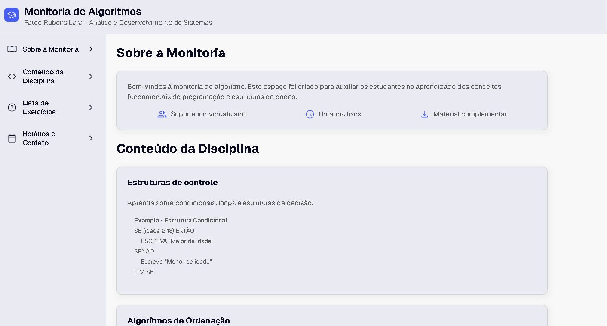

# 📘 Monitoria de Algoritmos e Lógica de Programação

Site desenvolvido para apoiar a monitoria da disciplina **Algoritmos e Lógica de Programação** da Fatec Rubens Lara (ADS).  
O objetivo é fornecer aos estudantes um espaço organizado com informações sobre monitoria, conteúdos teóricos, exemplos práticos, listas de exercícios e horários de atendimento.

---

## 📑 Sumário
- [Introdução](#introducao)
- [Demonstração](#demonstracao)
- [Estrutura do Projeto](#estrutura-do-projeto)
- [Instalação](#instalacao)
- [Uso](#uso)
- [Funcionalidades](#funcionalidades)
- [Tecnologias Utilizadas](#tecnologias-utilizadas)
- [Contribuição](#contribuicao)
- [Licença](#licenca)

---

## 🧾 Introdução <a id="introducao"></a>

Este projeto é um **site estático** que organiza o material de monitoria de Algoritmos.  
O conteúdo é dividido em seções, incluindo:

- Sobre a Monitoria  
- Conteúdo da Disciplina *(estruturas de controle, algoritmos de ordenação, estruturas de dados, etc.)*  
- Listas de Exercícios para download  
- Horários e Contato da monitoria  

---

## 🌐 Demonstração <a id="demonstracao"></a>

📷 
🔗 *Aqui ficará o futuro deploy do site*

---

## 📂 Estrutura do Projeto <a id="estrutura-do-projeto"></a>

```
/
├── index.html          # Estrutura principal do site
├── main.css            # Estilos globais e layout
├── conteudo.css        # Estilos específicos da seção de conteúdo
├── img/                # Imagens e ícones do site
├── main.js             # Script para interatividade (placeholder no momento)
└── README.md           # Documentação do projeto
```

---

## ⚙️ Instalação <a id="instalacao"></a>

Clone o repositório:

```bash
git clone https://github.com/SEU-USUARIO/site-monitoria.git
```

Acesse o diretório:

```bash
cd site-monitoria
```

Abra o arquivo `index.html` no navegador.

---

## ▶️ Uso <a id="uso"></a>

Navegue pelo menu lateral para acessar:

- Informações sobre a monitoria  
- Conteúdos teóricos com exemplos em pseudocódigo  
- Links para download das listas de exercícios  
- Horários presenciais e online  
- Informações de contato  

---

## ✨ Funcionalidades <a id="funcionalidades"></a>

- 📚 Organização do conteúdo da disciplina  
- 🖥️ Exemplos de pseudocódigo com blocos formatados  
- 📂 Links de exercícios para prática  
- ⏰ Exibição clara de horários de monitoria  
- 📱 Layout responsivo utilizando **CSS Grid** e **Flexbox**  

---

## 🛠️ Tecnologias Utilizadas <a id="tecnologias-utilizadas"></a>

- **HTML5** → Estrutura do site  
- **CSS3 (Flexbox e Grid)** → Estilização e layout  
- **Google Fonts (Geist, Geist Mono)**  
- **JavaScript (main.js)** → *espaço para futuras interações*  

---

## 🤝 Contribuição <a id="contribuicao"></a>

Contribuições são bem-vindas!  
Sugestões de melhorias podem ser feitas via **issues** ou **pull requests**.

---

## 📜 Licença <a id="licenca"></a>

Este projeto está sob a licença **MIT**.  
Você pode usá-lo, modificá-lo e distribuí-lo livremente, desde que mantenha a referência original.
